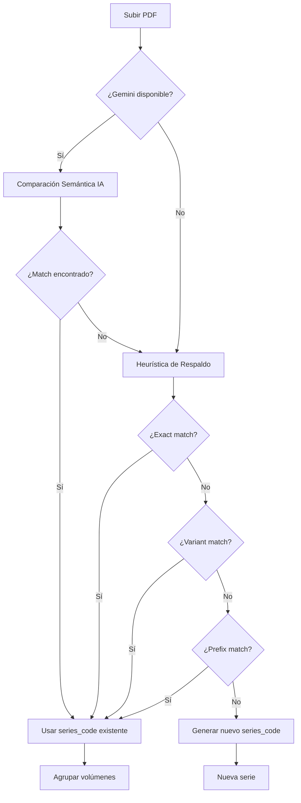

# 🤖 Agrupado Inteligente con Gemini AI

## 📋 Resumen

El sistema ahora incluye **agrupado inteligente de series** que usa las **10 API keys de Gemini** de forma optimizada para:

1. **Detectar series equivalentes** en diferentes idiomas
2. **Agrupar automáticamente** volúmenes/capítulos de la misma serie
3. **Preservar caracteres especiales** (ñ, acentos, comas) en títulos
4. **Rotar API keys** automáticamente para maximizar disponibilidad

---

## 🎯 Características Implementadas

### 1. Comparación Semántica con IA

Cuando subes un nuevo manga, el sistema:

```
📚 Nuevo archivo: "El Rey Demonio 2.pdf"

🤖 Gemini analiza series existentes:
   - "The Demon King" [código: 0211]
   
🤖✅ ¡Coincidencia detectada!
   Razón: "El Rey Demonio" es la traducción al español de "The Demon King"
   
🔗 Agrupa automáticamente con código 0211
```

**Ventajas:**
- ✅ Detecta traducciones (inglés ↔ español ↔ otros idiomas)
- ✅ Reconoce variantes ("Love Stage" = "Love Stage!!")
- ✅ Identifica continuaciones ("Title 2" pertenece a "Title")

### 2. Normalización Mejorada

**ANTES:**
```javascript
"¡Hola, Señor!" → "hola señor"  // ❌ Perdía caracteres importantes
```

**AHORA:**
```javascript
"¡Hola, Señor!" → "hola, señor"  // ✅ Preserva ñ, comas, acentos
"El Niño" → "el niño"            // ✅ Mantiene ñ
"Café, Té y Amor" → "café, té y amor"  // ✅ Mantiene comas y acentos
```

### 3. Sistema de Rotación de API Keys

El servicio **GeminiServiceRotation** gestiona 10 API keys automáticamente:

```
🔑 API Key #1 → ⚠️ Quota excedida
🔄 Rotando a API Key #2...
✅ Consulta exitosa con API Key #2

Rate limiting: 4.5s entre consultas (13 req/min por key)
Cooldown: 60s por key después de quota exceeded
```

**Configuración en `.env`:**
```bash
GEMINI_API_KEY_1=tu_primera_key
GEMINI_API_KEY_2=tu_segunda_key
GEMINI_API_KEY_3=tu_tercera_key
# ... hasta GEMINI_API_KEY_10
```

### 4. Heurística de Respaldo (Sin IA)

Si Gemini no está disponible o no detecta coincidencia, usa heurística inteligente:

1. **Exact Match:** Compara títulos normalizados exactamente
2. **Variant Match:** Compara sin sufijos numéricos (ej: "Title 2" → "Title")
3. **Prefix Match:** Detecta prefijos comunes (última opción)

---

## 📊 Flujo de Agrupado



---

## 🧪 Casos de Prueba

### Escenario 1: Traducción

```bash
# Subir primero "The Demon King.pdf"
curl -X POST http://localhost:3000/api/upload \
  -F "pdf=@The Demon King.pdf"
# → Crea serie con código 0211

# Subir después "El Rey Demonio 2.pdf"
curl -X POST http://localhost:3000/api/upload \
  -F "pdf=@El Rey Demonio 2.pdf"
# → 🤖 Gemini detecta: son la misma serie
# → Agrupa con código 0211 ✅
```

### Escenario 2: Continuación Numérica

```bash
# Subir "Love Stage.pdf"
# → Código 5432

# Subir "Love Stage 2.pdf"
# → 🔗 Heurística: detecta variante sin sufijo
# → Agrupa con código 5432 ✅
```

### Escenario 3: Caracteres Especiales

```bash
# Subir "El Niño del Mar.pdf"
# → Título normalizado: "el niño del mar" (mantiene ñ)

# Subir "El Niño del Mar - Cap 2.pdf"
# → Coincidencia exacta
# → Agrupa correctamente ✅
```

---

## 🔧 Configuración Óptima

### Variables de Entorno

```bash
# .env
PORT=3000
DB_PATH=./database/manga_library.db
UPLOADS_PATH=./uploads
COVERS_PATH=./uploads/covers

# 10 API Keys de Gemini (rotan automáticamente)
GEMINI_API_KEY_1=AIzaSy...primera
GEMINI_API_KEY_2=AIzaSy...segunda
GEMINI_API_KEY_3=AIzaSy...tercera
GEMINI_API_KEY_4=AIzaSy...cuarta
GEMINI_API_KEY_5=AIzaSy...quinta
GEMINI_API_KEY_6=AIzaSy...sexta
GEMINI_API_KEY_7=AIzaSy...septima
GEMINI_API_KEY_8=AIzaSy...octava
GEMINI_API_KEY_9=AIzaSy...novena
GEMINI_API_KEY_10=AIzaSy...decima
```

### Rate Limits

- **Por API Key:** 15 peticiones/minuto
- **Sistema:** 4.5s entre peticiones (13 req/min)
- **Con 10 keys:** ~130 peticiones/minuto teóricas
- **Cooldown:** 60s después de quota exceeded

---

## 📈 Beneficios

### Antes (Sin IA)
```
❌ "The Demon King" y "El Rey Demonio" → Series separadas
❌ "Love Stage!!" y "Love Stage" → Series separadas
❌ Títulos con ñ/acentos se normalizaban incorrectamente
```

### Ahora (Con IA)
```
✅ "The Demon King" y "El Rey Demonio" → Misma serie
✅ "Love Stage!!" y "Love Stage" → Misma serie
✅ Preserva ñ, acentos, comas en títulos
✅ 10 API keys con rotación automática
✅ Optimización: 1 consulta para análisis + metadata
```

---

## 🐛 Troubleshooting

### Gemini no detecta series equivalentes

**Solución:** Verifica logs en `logs/server.log`
```bash
tail -f logs/server.log | grep "Gemini"
```

Si ves errores 429 constantemente:
- Aumenta `minDelayBetweenRequests` en `gemini-service-rotation.js`
- Agrega más API keys en `.env`

### Series no se agrupan correctamente

**Opción 1:** Usar script de merge manual
```bash
node scripts/merge_similar_series.js --apply
```

**Opción 2:** Verificar logs de heurística
```bash
tail -f logs/server.log | grep "Agrupando"
```

### Caracteres especiales se pierden

**Verificar:** La normalización ahora usa regex `/[^\p{L}\p{N}\s,]/gu`
- ✅ Preserva todas las letras unicode (ñ, á, é, etc.)
- ✅ Preserva números y espacios
- ✅ Preserva comas

---

## 📚 Referencias

- **Código principal:** `server.js` (línea ~460-520)
- **Servicio IA:** `server/services/gemini-service-rotation.js`
- **Normalización:** Método `normalize()` en `server.js`
- **Script de merge:** `scripts/merge_similar_series.js`

---

## 🚀 Próximas Mejoras

- [ ] Cache de comparaciones IA para evitar consultas duplicadas
- [ ] Interfaz web para revisar/aprobar agrupados sugeridos
- [ ] Soporte para más idiomas (japonés, coreano, chino)
- [ ] API para sugerir merges de series existentes
